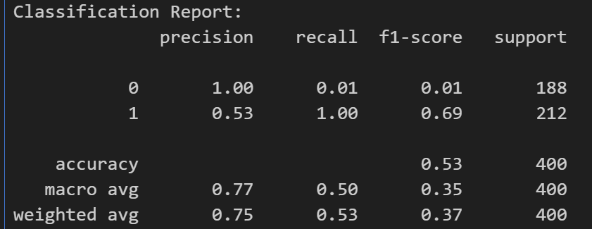

# neural-network-challenge-1

# Module 18, Student loan re-financing challenge

This module was broken down into 4 sections.

1. Prepare the data.
    - Using provided data, I read the data in to a DF.  Then reviewed the data for any null values or anomolies.
    - Next step was to split the data set in to X and y features, then run the standard scaler.

2. Compile and evaluate the model using a neural network.
    - Using Tensorflow, I created a neural network using Keras and then defined the layers of the model.  Input, hidden, and output.
    - I then compiled the model using binary_crossentropy loss model, the Adam optimizer, and the accuracy evaluation metric.
    - Last step was to evalaute the model and save it.

3. Predict the loan payment using the neural network model.
    - I loaded the model
    - Ran the prediction function.
    - Then generated a classification report with preductions and testing data.

    Below is the output from the classification report.
    - The model shows moderate performance.
    - Class 1 seemed to do a better job.
    - Class 0 seemed to struggle to predict with accuracy or consistency.

    

4. Discussion questions on creating a recommendations system for student loans.

**1. Describe the data that you would need to collect to build a recommendation system to recommend student loan options for students. Explain why this data would be relevant and appropriate.**
Student's demographics, credit history, income, ... data, to help with establish student's financial history, needs, and eligibility.
Types of loans, to give greater flexiblity to match student's needs with options.
Purpose of the loan, to align loan options to reasons.  And assess equity, amount, and other loan conditions.
Market data to provide current assessment and update recommendations engine.

**2. Based on the data you chose to use in this recommendation system, would your model be using collaborative filtering, content-based filtering, or context-based filtering? Justify why the data you selected would be suitable for your choice of filtering method.**
Content-based filtering to help match students to personalized loan options.

**3. Describe two real-world challenges that you would take into consideration while building a recommendation system for student loans. Explain why these challenges would be of concern for a student loan recommendation system.**
Data Privacy and security.
The changing nature of loan products.  Must peg against market and update based on macro, micro economic trends as well as changes in loan product, rates, etc.  Without perpetual, current data both the student and the loan products can be out of step with market needs.

____
Assignment completed by Louis Canjar, student, UNC AI Bootcamp
Leveraged assistance from the portal's Xpert Learning Assistant:
https://bootcampspot.instructure.com/courses/6028/external_tools/313
